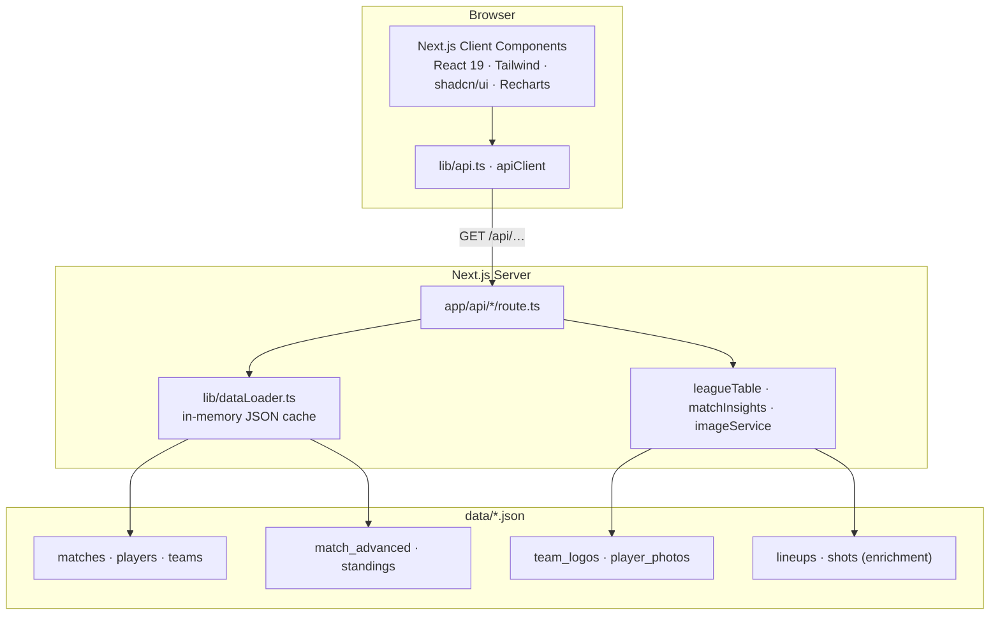

<div align="center">

# FOOT INSIGHTS

### Where every number tells a story

A data-driven football analytics platform for the **2022–23 season** — covering the **FIFA World Cup** and **Europe’s top five leagues**. Built with Next.js over a custom ETL pipeline that turns multi-source match and player data into an analytics-ready API.

<br />

[](https://nextjs.org/)
[](https://react.dev/)
[](https://www.typescriptlang.org/)
[](https://tailwindcss.com/)
[](#license)

<br />

| Matches | Goals | Teams | Players | Competitions |
|:-------:|:-----:|:-----:|:-------:|:------------:|
| **1,890** | **5,000+** | **130** | **680+** | **6** |

<br />

[Features](#-features) ·
[Screenshots](#-screenshots) ·
[Architecture](#-architecture) ·
[Quick Start](#-quick-start) ·
[Data](#-data--etl) ·
[Docs](#-documentation)

</div>

---

## Why Foot Insights?

Most football dashboards either scrape live APIs or invent metrics they don’t have. Foot Insights takes a different path: a **fixed 2022–23 season archive**, carefully normalized offline, then served through a thin, typed API layer.

That means:

- **Honest analytics** — advanced metrics (xG, possession, pass accuracy) appear only where the source data actually provides them (World Cup). League matches fall back to real base stats, never fabricated ones.
- **Real scale, no database** — nearly two thousand matches and hundreds of player profiles ship as static JSON, cached in memory, and loaded on demand.
- **Editorial + analytical** — iconic derbies, World Cup narratives, and “Stars of the Era” sit alongside leaderboards, league tables, and per-90 breakdowns.

> **Tagline from the product:** *Where every number tells a story.*

---

## ✨ Features

<table>
<tr>
<td width="50%" valign="top">

### Match intelligence
Browse all **1,890** fixtures with search, competition, and result filters. Each match card can surface a short narrative — clinical win, volume-driven victory, discipline edge — derived from real stats.

**Match detail** includes scoreboards, head-to-head bars, shot funnels, and World Cup xG / possession panels when available.

</td>
<td width="50%" valign="top">

### Player deep-dives
World Cup squads with goals, assists, xG/xA, per-90 rates, and trait bars (Finishing, Creativity, Passing, Defending). Spotlight rankings for Golden Boot, Playmaker, and Threat Level.

Profiles include club enrichment, position colour coding, and photo lookup with graceful silhouettes on miss.

</td>
</tr>
<tr>
<td width="50%" valign="top">

### Competitions & tables
Full pages for Premier League, La Liga, Bundesliga, Serie A, and Ligue 1 — standings, recent results, top scorers and assists.

A dedicated **World Cup hub** with group tables and an interactive knockout bracket.

</td>
<td width="50%" valign="top">

### Accolades & imagery
Season awards and per-league records. Team badges and player cutouts proxied through Next.js (CORS-safe, cache-friendly). Country flags via flagcdn.

Curated **iconic matches** and legend cards give the archive a magazine feel — not just a spreadsheet in a dark theme.

</td>
</tr>
</table>

---

## 🖼 Screenshots

<p align="center">
  
  <br />
  <em>Homepage — season glance, iconic fixtures, competitions, and editorial highlights</em>
</p>

<p align="center">
  
  <br />
  <em>Player detail — overview metrics, attribute bars, and per-90 breakdown</em>
</p>

<p align="center">
  
  &nbsp;
  
  <br />
  <em>Players grid &amp; spotlights · Accolades / season awards</em>
</p>

---

## 🏗 Architecture

Static archives in, typed API out, React on top — no database required.



### Design decisions that matter

| Choice | Why |
|--------|-----|
| **Static JSON over a DB** | Fixed season archive; zero ops; deploys anywhere |
| **In-memory `dataLoader` cache** | Parse once per process; data never changes at runtime |
| **On-demand API routes** | Clients fetch only the slice they need — list, detail, table, photo |
| **Image proxy routes** | Avoid CORS / hotlink issues; set long-lived cache headers |
| **Honest metric boundaries** | xG & possession only for World Cup; leagues use base + derived stats |

---

## 🛠 Tech stack

| Layer | Technology |
|-------|------------|
| Framework | **Next.js 16.1** (App Router, Turbopack) |
| UI | **React 19** · Tailwind CSS 3.4 · shadcn/ui |
| Language | **TypeScript 5.7** |
| Charts | Recharts 2.15 |
| Icons | Lucide React |
| Themes | next-themes (dark-first pitch theme) |
| Package manager | pnpm 10 |
| Runtime | Node.js 18+ |

---

## 🚀 Quick start

```bash
# 1. Clone
git clone https://github.com/your-username/foot-insights.git
cd foot-insights

# 2. Install
pnpm install

# 3. Optional env (not required for local dev)
cp .env.example .env.local

# 4. Run
pnpm dev
```

Open **[http://localhost:3000](http://localhost:3000)**.

| Script | What it does |
|--------|----------------|
| `pnpm dev` | Dev server (Turbopack) |
| `pnpm build` | Production build |
| `pnpm start` | Serve production build |
| `pnpm lint` | ESLint |

---

## 🗺 Pages & routes

| Route | What you get |
|-------|----------------|
| `/` | Dashboard — KPIs, iconic matches, competitions, editorial moments |
| `/matches` | All fixtures — search, competition & result filters |
| `/matches/:id` | Score, stats, lineups context, xG when available |
| `/players` | Grid + Golden Boot / Playmaker / Threat Level spotlights |
| `/players/:id` | Overview & Full Stats — attributes, per-90, contributions |
| `/teams` | Clubs & nations grouped by competition |
| `/teams/:id` | Form, position, squad, attacking / defensive splits |
| `/standings` | World Cup group tables |
| `/worldcup` | Groups + interactive knockout bracket |
| `/accolades` | Season awards & per-league records |
| `/leagues/:slug` | Full table, results, top scorers / assists |

**League slugs:** `premier-league` · `la-liga` · `bundesliga` · `serie-a` · `ligue-1`

---

## 📦 Data & ETL

All analytics data lives under `data/` as static JSON, loaded server-side through `lib/dataLoader.ts`.

### Coverage

| Competition | Matches | Teams |
|-------------|---------|-------|
| Premier League | 380 | 20 |
| La Liga | 380 | 20 |
| Serie A | 380 | 20 |
| Ligue 1 | 380 | 20 |
| Bundesliga | 306 | 18 |
| FIFA World Cup | 64 | 32 |
| **Total** | **1,890** | **130** |

### Core datasets

| File | Role |
|------|------|
| `matches.json` | League + World Cup results & base match stats |
| `match_advanced.json` | xG, possession, pass accuracy (World Cup) |
| `players.json` | Squads + tournament / season stats |
| `teams.json` | Clubs and national teams |
| `standings.json` | World Cup groups A–H |
| `team_logos.json` / `player_photos.json` | Pre-fetched imagery maps |
| `match_lineups.json` / `player_shots.json` | Enrichment layers (lineups, shot events) |

### Sources

- **Matches** — football-data.co.uk CSVs (top five leagues) + FIFA World Cup records  
- **Players** — squads enriched via offline scripts (club, per-90, penalties, Understat where applicable)  
- **Logos & photos** — TheSportsDB (proxied; local URL maps for speed)  
- **Flags** — flagcdn.com  

Offline Python / Node scripts transform CSVs and third-party feeds into the JSON the app consumes. The Next.js API is a **thin adapter** — reshape, cache, respond.

<details>
<summary><strong>Data maintenance scripts</strong></summary>

```bash
node scripts/enrich_players.js          # Enrich player JSON from source CSVs
node scripts/fetch_team_logos.js        # Refresh team badge URL map
node scripts/fetch_player_photos.js     # Refresh player photo URL map
node scripts/fetch_understat_shots.js   # Shot-level enrichment (pnpm data:shots)
python scripts/fetch_match_lineups.py   # Lineup enrichment (pnpm data:lineups)
```

</details>

---

## 🎨 Product design

Dark mode is the default — a **pitch-green** accent on near-black surfaces, built for scoreboards and dense stats.

| Token | Role |
|-------|------|
| Pitch green (`#1a7d4e` family) | Brand, CTAs, primary metrics |
| Cream / fog text | Hierarchy on dark canvas |
| Position colours | GK amber · DF blue · MF green · FW red |
| League accents | PL purple · La Liga orange/red · Bundesliga green · Serie A blue · Ligue 1 cyan |

UI patterns: sticky blurred header, large score typography, sports cards with soft green hover, medal styling on leaderboards, W/D/L form streaks, and intentional motion (`slide-up`, `slide-in`, subtle pulse) — presence without noise.

---

## 🔌 API surface

All routes are **GET-only**. No auth. Base path `/api` (override with `NEXT_PUBLIC_API_BASE`).

| Endpoint | Purpose |
|----------|---------|
| `/api/summary` | Dashboard KPIs |
| `/api/matches` · `/api/matches/[id]` | Match list & detail |
| `/api/players` · `/api/players/[id]` | Player list & detail |
| `/api/standings` | World Cup groups |
| `/api/accolades` | Awards computation |
| `/api/league-table` | League table builder |
| `/api/team-logo` · `/api/team-logo-proxy` | Badge URL / image bytes |
| `/api/player-photo` | Headshot lookup |
| `/api/league-logo` | Competition mark helper |

Full request/response shapes → **[docs/API.md](docs/API.md)**

---

## 📁 Project map

```
foot-insights/
├── app/                 # App Router pages + GET API routes
├── components/          # Domain UI + shadcn/ui primitives
├── lib/                 # types, dataLoader, api client, insights, images
├── hooks/               # Shared React hooks
├── data/                # Analytics-ready JSON archives
├── scripts/             # Offline enrichment & image fetch
├── docs/                # Architecture, API, contributing, deployment
└── public/logos/        # Favicon + league assets
```

<details>
<summary><strong>Expand key folders</strong></summary>

```
app/
├── page.tsx                  # Homepage dashboard
├── matches/ · players/ · teams/
├── standings/ · worldcup/ · accolades/
├── leagues/[slug]/
└── api/                      # summary, matches, players, standings,
                              # accolades, league-table, logos, photos

components/
├── Header · Footer · MatchCard · KnockoutBracket
├── TeamLogo · PlayerPhoto · CountryFlag · StatBar
├── StarsOfEra · *PageClient shells
└── ui/                       # shadcn primitives

lib/
├── api.ts · dataLoader.ts · types.ts
├── leagueTable.ts · matchInsights.ts
├── imageService.ts · utils.ts
```

</details>

---

## ⚙️ Environment

| Variable | Required | Default | Description |
|----------|----------|---------|-------------|
| `NEXT_PUBLIC_API_BASE` | No | `""` (relative) | API base URL override for CDN / custom domains |

Template: [`.env.example`](.env.example)

---

## 📚 Documentation

| Doc | Contents |
|-----|----------|
| [Project Overview](docs/PROJECT_OVERVIEW.md) | Full product map — data, stats, imagery, design language |
| [Architecture](docs/ARCHITECTURE.md) | Technical design, request lifecycle, caching |
| [API Reference](docs/API.md) | Endpoints, parameters, responses |
| [Contributing](docs/CONTRIBUTING.md) | Workflow & coding standards |
| [Deployment](docs/DEPLOYMENT.md) | Production deployment guide |

---

## ⚠ Analytics honesty

Advanced metrics such as **expected goals (xG)**, **possession**, and **pass accuracy** are available **only for World Cup matches**. Most public league datasets do not provide these fields.

League matches intentionally use **base and derived statistics** only — so the product never invents analytics the source data cannot support.

---

<div align="center">

## License

**MIT** — for demonstration and portfolio use.

<br />

**FOOT INSIGHTS** · Built with Next.js · 2022–23 season archive

</div>
